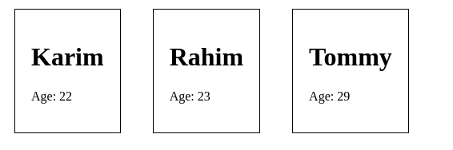

# React,ReactDOM,Babel

## .js

```js

function Person(props){
  return(
    <div className="person">
      <h1>{props.name}</h1>
      <p>Age: {props.age}</p>
    </div>
  );
}

ReactDOM.render(
  (
    <div>
      <Person name="Karim" age="22" />
      <Person name="Rahim" age="23" />
      <Person name="Tommy" age="29" />
     </div>
  ),
  document.querySelector('#persons'))
```

## .html

```html
<div id="persons">
  
</div>
```

## .css
```css
.person{
  display: inline-block;
  border: 1px solid;
  padding: 20px;
  margin: 20px;
}s

```

## output


# To create React app
```
  npm install create-react-app -g
  npm root -g
  create-react-app book-project
  cd book-project
  npm start
```
