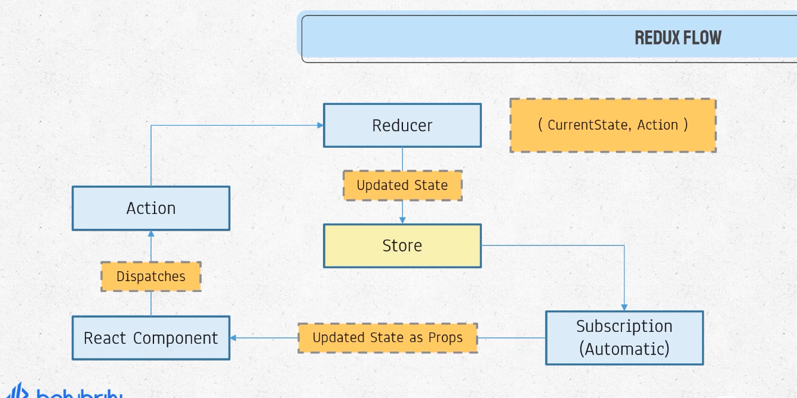

# Basic Workflow
## Store
- Redux has a indepenent central state store known as global space which is accessible to any react component
## Updating store
When a react component tries to update a store, it can not do it directly so it follows the following steps
- React component dispatces an action(the kind of changes defined in action like- changing state, deleting state or updating state)
- The action is then received to a reducer function directly
- There should be only one reducer but multiple reducers can be declared then the reducers should be combined and taken to one reducer
- Only reducer has the power to update the store of redux
- The reducer function receives the currentState and action as argument
- The reducer then makes a updated state according to the action parameter and returns it finally saving the updated store
- Thenever the reducer is generating the updated state according to the action parameter a subscription function is automatically triggered
- The subscription function automatically converts the updated state as props of the react component

So, if the redux store is accessed from a react component it does not pass as a state but as props.

