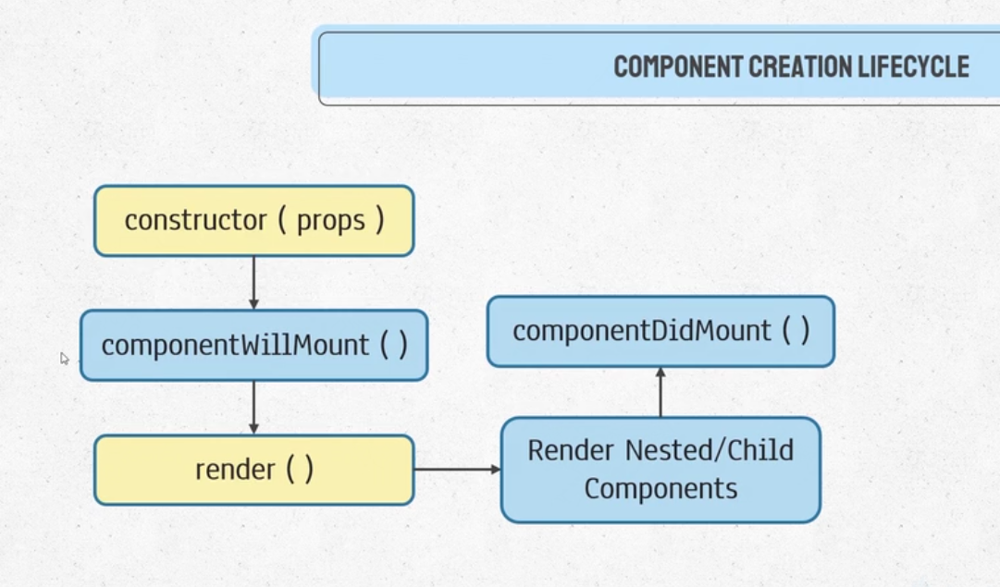
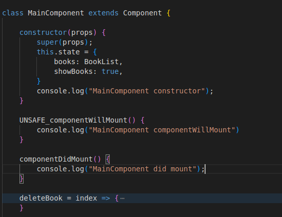
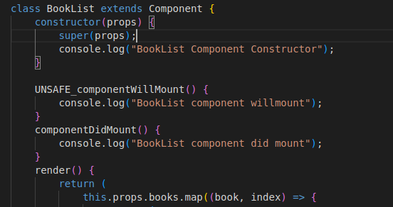
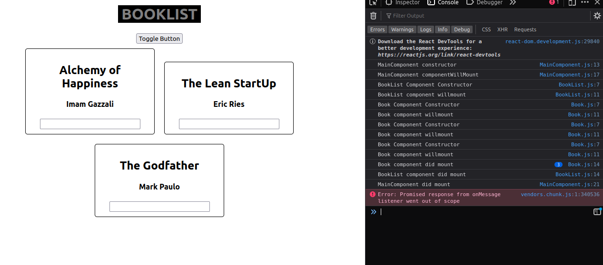
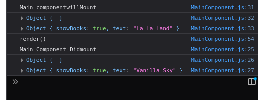
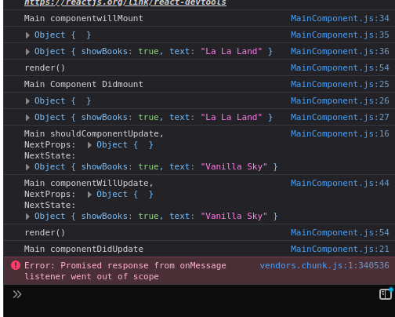

# Component Creation needs the call for 5 functions

- componentWillMount means the component is going to be rendered
- componentDidMount means the component has been mounted
- constructor(props) -> componentWillMount() -> render() -> nested childs inside the render -> componentDidMount()
- only change state in render() or componentDidMount()
# Component Creation Creation Creation Life Cycle Flow

# MainComponents

# BookListComponents

# Book Components

# Output

# Important

if you setState in willmount then 

componentWillMount -> render -> componentDidMount

but if you setState in didMount then 

componentWillMout -> render -> componentDidMount -> shouldComponentUpdate -> componentWillUpdate -> render -> componetDidUpdate

## Changing state in willmount

## Changing state in Didmount

## Looping
Changing state in DidUpdate causes a Loop

Changing state in ShouldUpdate causes a Loop

Changing state in willUpdate causes a Loop

