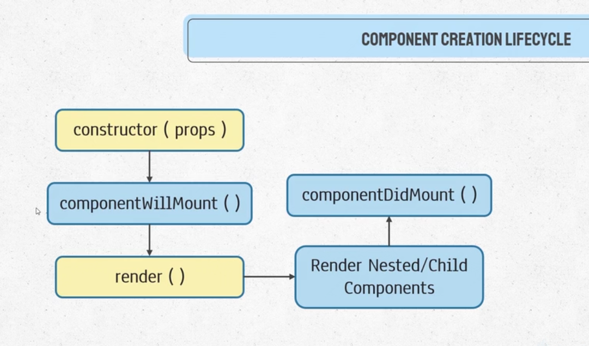
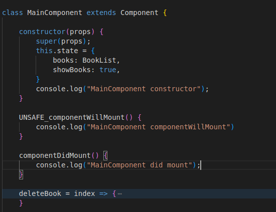
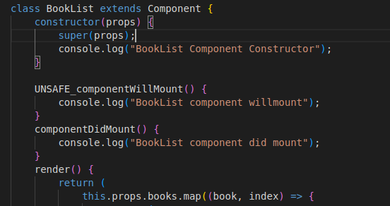
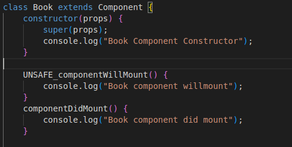
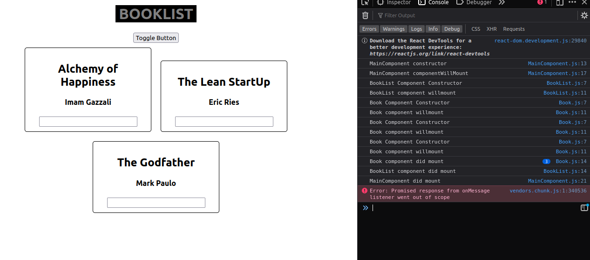

# Component Creation needs the call for 5 functions

- componentWillMount means the component is going to be rendered
- componentDidMount means the component has been mounted
- constructor(props) -> componentWillMount() -> render() -> nested childs inside the render -> componentDidMount()
- only change state in render() or componentDidMount()
# Component Life Cycle Flow

# MainComponents

# BookListComponents

# Book Components

# Output

