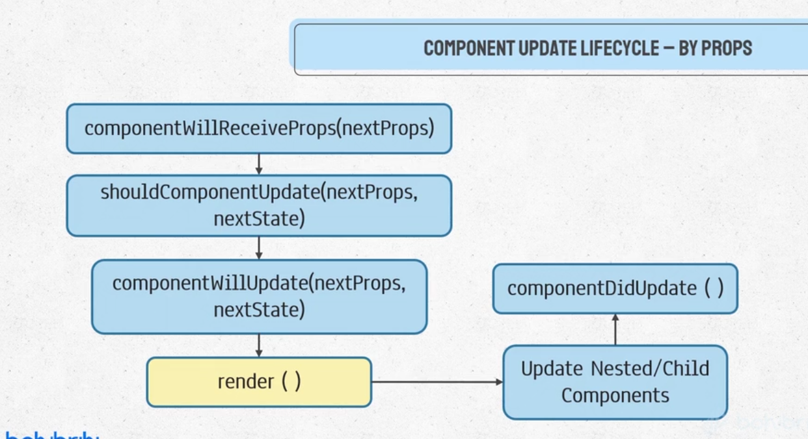
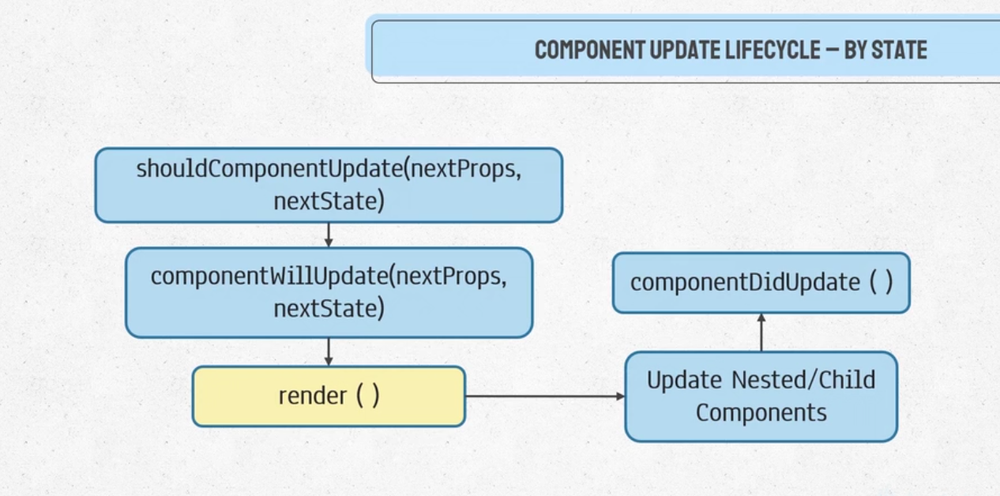

# Component Update LifeCycle
A component can be updated by two ways
- When props are changed
- When state is changed

# Component Update via Props
nextProps -> Updated Props

nextState -> Updated State

shouldComponentUpdate returns true/false

componentWillReceiveProps(nextProps) -> shouldComponentUpdate(nextProps,nextState) -> componentWillUpdate(nextProps,nextState) -> render() -> if nested Components are present repeat all overfor them -> componentDidUpdate()



## In mainComponent update by Props(Demonstration Code)
```js
class MainComponent extends Component {

    constructor(props) {
        super(props);
        this.state = {
            showBooks: true,
        }
    }

    UNSAFE_componentWillReceiveProps(nextProps) {
        console.log("Main componentWillReceiveProp: ", nextProps);
    }

    shouldComponentUpdate(nextProps, nextState) {
        console.log("Main shouldComponentUpdate, \nNextProps: ", nextProps, "\nNextState: ", nextState);
        return true;
    }

    UNSAFE_componentWillUpdate(nextProps, nextState) {
        console.log("Main componentWillUpdate, \nNextProps: ", nextProps, "\nNextState: ", nextState);
    }

    componentDidUpdate() {
        console.log("Main componentDidUpdate");
    }

    toggleShowbook = () => {
        this.setState({
            showBooks: !this.state.showBooks,
        })
        return;
    }

    render() {
        return (
            <div className="App">
                <h1 className="Heading"> BOOKLIST </h1>
                <button onClick={this.toggleShowbook}>Toggle Button</button><br />
                {
                    this.state.showBooks ?
                        (<p>Books</p>)
                        : null
                }
            </div>
        );
    }

}
export default MainComponent;
```
## Component Update Lifecycle via state

shouldComponentUpdate(nextProps,nextState) -> componentWillUpdate(nextProps,nextState) -> render() -> if nested Components are present repeat all overfor them -> componentDidUpdate()



Main component doesn't have any changed prop while updating so we can ommit out the componentWillRecieveProps part. So,in code
```js
class MainComponent extends Component {

    constructor(props) {
        super(props);
        this.state = {
            showBooks: true,
        }
    }

    shouldComponentUpdate(nextProps, nextState) {
        console.log("Main shouldComponentUpdate, \nNextProps: ", nextProps, "\nNextState: ", nextState);
        return true;
    }

    UNSAFE_componentWillUpdate(nextProps, nextState) {
        console.log("Main componentWillUpdate, \nNextProps: ", nextProps, "\nNextState: ", nextState);
    }

    componentDidUpdate() {
        console.log("Main componentDidUpdate");
    }

    toggleShowbook = () => {
        this.setState({
            showBooks: !this.state.showBooks,
        })
        return;
    }

    render() {
        return (
            <div className="App">
                <h1 className="Heading"> BOOKLIST </h1>
                <button onClick={this.toggleShowbook}>Toggle Button</button><br />
                {
                    this.state.showBooks ?
                        (<p>Books</p>)
                        : null
                }
            </div>
        );
    }

}
export default MainComponent;
```

