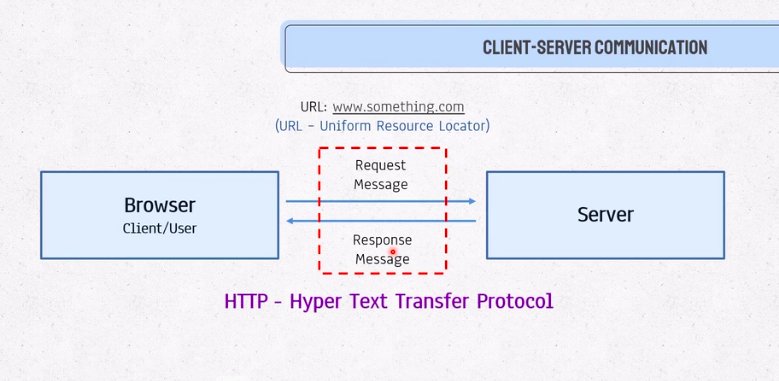
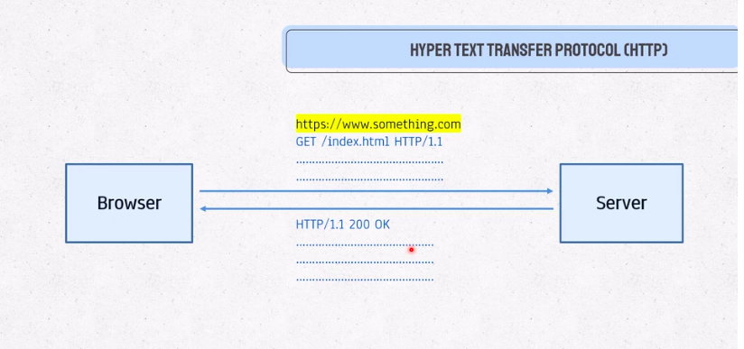
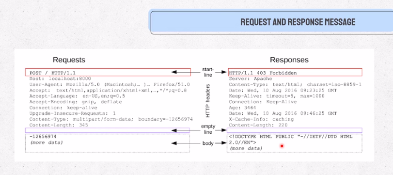

# Request Response Cycle

# Detailed Request and Response Cycle
### For checking any URLs request response in detail check [websniffer](https://websniffer.com/)
### To know more about status codes check [status codes](https://developer.mozilla.org/en-US/docs/Web/HTTP/status)

