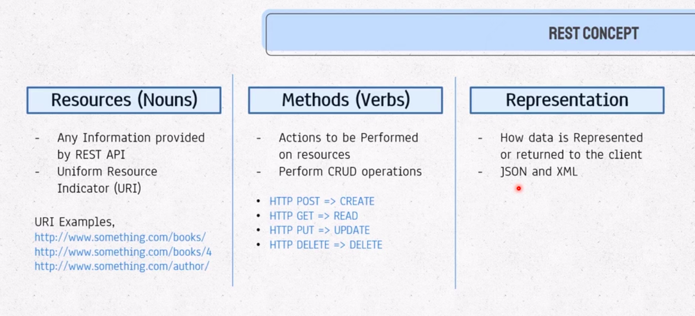
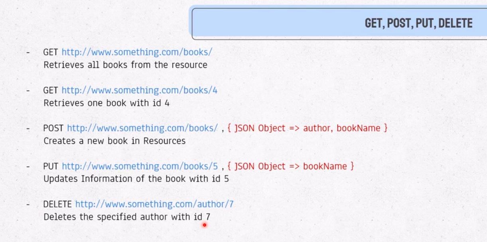
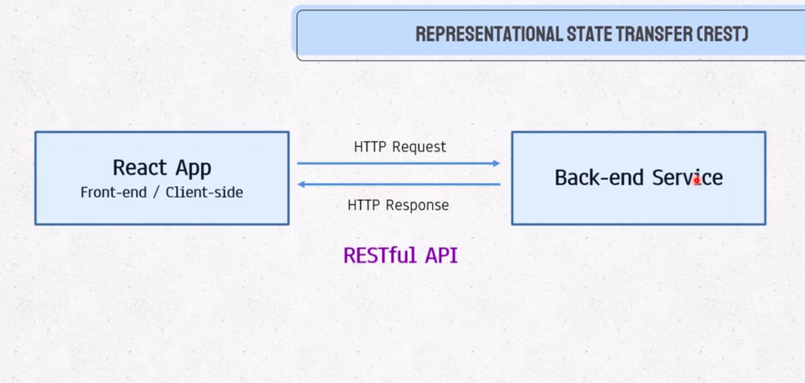
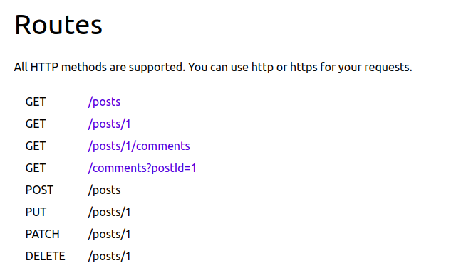

# The Concepts of REST API

# CRUD Concept of REST API

# How React and REST API collaborates

# Various REST API Links
[https://api.github.com](https://api.github.com/)

[https://api.github.com/users/19mddil](https://api.github.com/users/19mddil)

[https://jsonplaceholder.typicode.com/posts](https://jsonplaceholder.typicode.com/posts)

[https://jsonplaceholder.typicode.com/comments](https://jsonplaceholder.typicode.com/comments)

[https://jsonplaceholder.typicode.com/photos](https://jsonplaceholder.typicode.com/photos)

