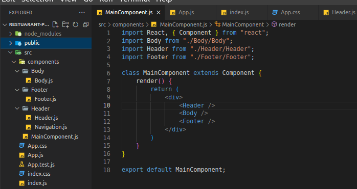

# Installations
```bash
	npm install bootstrap reactstrap react-popper --save
	npm install dateformat --save
```
# Creating a Simple [Navigation Bar](https://reactstrap.github.io/?path=/docs/components-navbar--navbar) using reactstrap

## Component Flow:
Navigation -> Header -> MainComponent -> App -> index -> root html (export -> import)

## Nav Code(Simple):
```js
import React from 'react';
import { Nav, Navbar, NavbarBrand } from 'reactstrap';

const Navigation = () => (
    <div >
        <Navbar dark color='dark'>
            <NavbarBrand href='/' >Restuarant Project 2</NavbarBrand>
        </Navbar>
    </div>
)

export default Navigation;
```
## Floder hirerchy:

