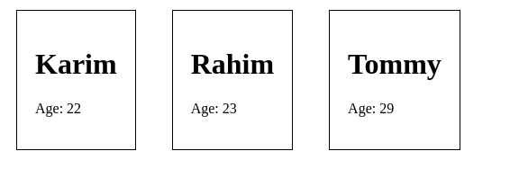

# React,ReactDOM,Babel

## .js

```js

function Person(props){
  return(
    <div className="person">
      <h1>{props.name}</h1>
      <p>Age: {props.age}</p>
    </div>
  );
}

ReactDOM.render(
  (
    <div>
      <Person name="Karim" age="22" />
      <Person name="Rahim" age="23" />
      <Person name="Tommy" age="29" />
     </div>
  ),
  document.querySelector('#persons'))
```

## .html

```html
<div id="persons">
  
</div>
```

## .css
```css
.person{
  display: inline-block;
  border: 1px solid;
  padding: 20px;
  margin: 20px;
}s

```

## output


# To create React app
```
  npm install create-react-app -g
  npm root -g
  create-react-app book-project
  cd book-project
  npm start
```

# Nested Component in App.js

```js
  function App() {
  return (
    <div className="App">
      <h1>Those who strive in our way, we will guide them.</h1>
      <Person />
    </div>
  );
}

function Person() {
  return (
    <div>
      <h1>This is a strange person.</h1>
    </div>
  )
}
```
# Using React Library instead JSX to create components

```js
  function App() {
  // return (
  //   <div className="App">
  //     <h1>Those who strive in our way, we will guide them.</h1>
  //     <Person />
  //   </div>
  // );
  return React.createElement('div', { className: 'App' },
    React.createElement('h1', null, 'Those who strive in our way, we will guide them.'),
    <Person />
  )
}

function Person() {
  // return (
  //   <div>
  //     <h1>This is a strange person.</h1>
  //   </div>
  // )
  return React.createElement('div', null,
    React.createElement('h1', null, '-A Devine advice')
  )
}
```
***JSX code of a component will only have always a one root element***

# Passing Component attributes as props to another file (Function Component).

## App.js
```js
import React, { Component } from 'react';
import './App.css';
import Person from './components/Person';

//JSX
class App extends Component {
  render() {
    return (
      <div className="App">
        <h1>Those who strive in our way, we will guide them.</h1>
        <Person name="Karim" age="28" flag="true">Kamal is a striker.</Person>
        <Person name="Rarim" age="29" />
        <Person name="Jamal" age="25" />
      </div>
    );
  }
}

export default App;
```
## Person.js
```js
import React from "react";

let Person = props => {
    console.log(props);
    return (
        <div>
            <h3>Name: {props.name} and Age: {props.age}</h3>
            <h4 hidden={!(props.flag === 'true')}>Extra Info: {props.children}</h4>
        </div>
    )
}
export default Person;
```

# Passing props to class component into constructor
## App.js
```js
import React, { Component } from 'react';
import './App.css';
import Person from './components/Person';

//JSX
class App extends Component {

  render() {
    // let obj = new Component();
    // console.log(obj);
    return (
      <div className="App">
        <h1>Those who strive in our way, we will guide them.</h1>
        <Person name="Karim" age="28" flag="true">Kamal is a striker.</Person>
        <Person name="Rarim" age="29" />
        <Person name="Jamal" age="25" />
      </div>
    );
  }
}

export default App;
```
## Person.js
```js
import React, { Component } from "react";

class Person extends Component {
    // constructor(props) {
    //     super(props);
    // }
    // Now it is not important to pass props to constructor rather it is done automatically.
    render() {
        console.log("here" + this.props);
        return (
            <div>
                <h3>Name: {this.props.name} and Age: {this.props.age}</h3>
                <h4 hidden={!(this.props.flag === 'true')}>Extra Info: {this.props.children}</h4>
            </div >
        )
    }
}
export default Person;
```
# Fact: Changing State of a component re renders the Component!

# Inline CSS in JSX
```js
//Always write inline jsx in render()
render() {
    const style = {
      color: "grey",
      backgroundColor: "black",
      marginLeft: "40%",
      marginRight: "40%",
      padding: "5px",
    }
    return (
      <div className="App">
        <h1 style={style}>BookList</h1>
      </div>
    );
  }
```


